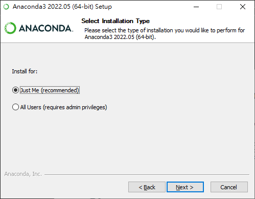

# 盡可能簡單教怎麼在Windows平台上建立用Visual Studio Code開發的PyTorch或Tensorflow
首先你需要一張[支援Cuda運算的NVIDIA顯示卡](https://developer.nvidia.com/cuda-gpus) (較常見的消費級顯示卡屬於GeForce或TITAN) 並裝好驅動程式，接著是以下這些軟體，你可以先從這裡的超連結去他們官網下載最新版本

- [Anaconda](https://www.anaconda.com/products/distribution)  示範版本2022.05
- [Cuda ToolKit](https://developer.nvidia.com/cuda-downloads) 示範版本11.7
- [cuDNN](https://developer.nvidia.com/rdp/cudnn-download) 示範版本8.4.0
- [Visual Studio Code](https://code.visualstudio.com/) 示範版本2022 (下稱VSCode，因為大家都這樣叫) 

## 安裝Cuda Toolkit
我忘記截圖了，只要下一步到底就好，__務必要記得安裝路徑__ 
安裝過程中螢幕閃爍是自然現象不用怕 
 
## 安裝cuDNN
在Cuda Toolkit資料夾裡進到這一層資料夾 
 
打開cuDNN的壓縮檔，把裡面的bin, include, lib拖進去剛剛叫你找的資料夾 
 
有些人後續執行的時候會遇到找不到zlibwapi.dll的問題，這點其實在NVIDIA自己的[cuDNN installation guide](https://docs.nvidia.com/deeplearning/cudnn/install-guide/index.html#installwindows)有提到，我的解決方式也很簡單:  
1. 下載[ZLIB DLL](http://www.winimage.com/zLibDll/zlib123dllx64.zip)  
2. 打開壓縮檔裡的`dll_x64`資料夾，把`zlibwapi.dll`放到你電腦裡的`C:\Windows\System32`就好
## 安裝Anaconda
1. 打開安裝檔 <del>不然載心酸?</del> 
 
2. 照它建議裝給你自己就好 
 
3. 選安裝路徑，雖然之後有需要還是能用各種方式找到，但建議稍微記一下自己裝在哪 
 
4. 因為我們要另外裝VSCode而不是用Anaconda給的IDE，所以上面那個選項記得要勾 
 
5. 等它好，下面的Next會亮起來，按到你畫面看起來跟步驟6.很像 
 
6. 這裡兩個選項本來是勾著的，但既然你都在看這篇教學了就不需要勾上面那個了對吧? 按Finish離開即可 
 
## 安裝VSCode
基本上跟安裝Anaconda 87%像，我挑重點簡單講  
1. 選安裝路徑的地方 
 
2. 如果這裡有建立開始的資料夾的話就可以在開始裡面直接或是用搜尋找到並開啟VSCode，很方便所以我選擇讓它建 
 
3. 我翻譯一下下面那四個比較難懂的選項
- 對檔案按右鍵時有一個捷徑可以用VSCode打開它
- 對資料夾按右鍵時有一個捷徑可以用VSCode打開它
- 支援的檔案可以一按就用VSCode打開
- 可以用cmd輸入Code打開VSCode 
 
4. 安裝好以後開啟VSCode做初次設定，看不懂英文可以裝內建的繁中套件，我一開就被問要不要裝了，剩下都是個人設定的東西而且很簡單我就不教了 
 
## 新增環境，我以Tensorflow舉例
如果你要裝PyTorch或其他套件只需要把指令中的tensorflow換成套件名稱就好 
VSCode基本上只是非常強大的文字編輯器，所以要開發還是要架環境給VSCode執行  
### **__註: 因為不是每個人都有打Terminal的經驗，所以在這裡提醒以下只要提到輸入就是打完指令按Enter__**
1. 開啟Anaconda的Terminal 
 
2. 輸入`conda create --name \[name\]` ，請將\[name\]改成自己取的名字，例如我這裡取tf，Proceed輸入y，這樣就建立好一個名為tf的環境了 
 
完成之後視窗會告訴你要打什麼指令啟動你剛剛建立的環境 
 
3. 輸入`conda activate \[name\]`進入環境 
 
4. 輸入`pip install tensorflow`，就會開始下載和安裝Tensorflow和所有它需要的套件，所有跟套件有關的東西都是圍繞著`pip` 
 
只要看到我標記起來的這段關鍵字並且底下的輸入欄回來了就是安裝完了 
 
pip和conda其實都是在做套件管理的指令，只有一些結構上的細微差別，該用哪個很多人爭論，我都是用conda包著pip所以不要跟我吵該用哪個，但你如果知道這兩者的差別而且你自己有要用哪個的主見的話也不需要來看這篇教學對吧?  
## 至此，所有安裝作業都完成了，檢查一下吧
新增一個.py檔，寫這些指令並執行 
 
輸出裡面有提到GPU就是成功了 

